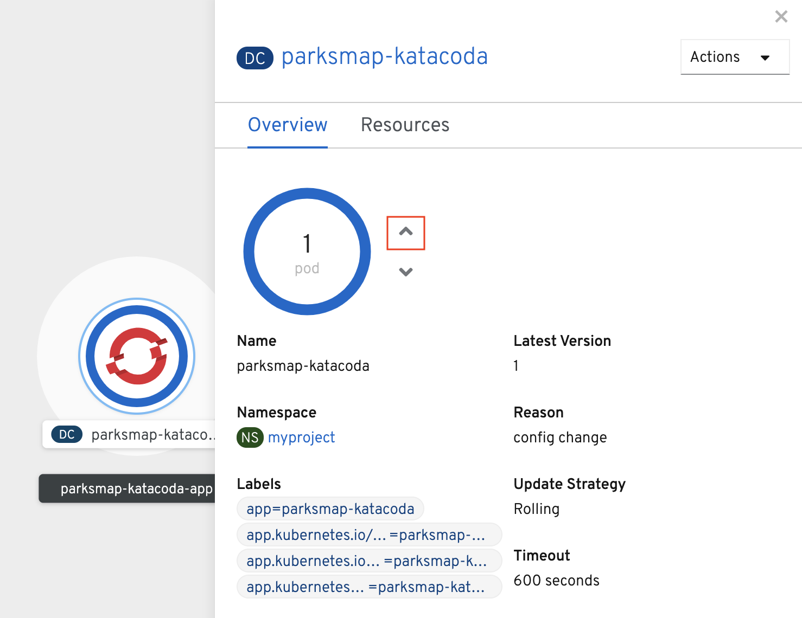
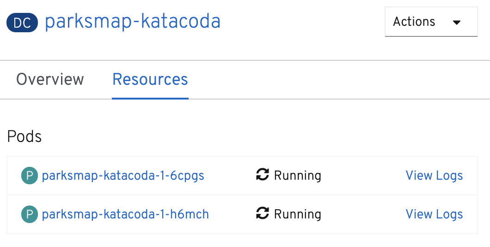

Let's scale our application up to 2 instances of the pods. You can do this by clicking the "up" arrow next to
the *Pod* in the OpenShift web console on the overview page.

To verify that we changed the number of replicas, click the pods number in the circle next to the arrows.
You should see a list with your pods similar to the following by scrolling to the bottom of the web console:

You can see that we now have 2 replicas.

Overall, that's how simple it is to scale an application (*Pods* in a
*Service*). Application scaling can happen extremely quickly because OpenShift
is just launching new instances of an existing image, especially if that image
is already cached on the node.

### Application "Self Healing"

Because OpenShift's *DeploymentConfigs* are constantly monitoring to see that the desired number
of *Pods* is actually running, you might also expect that OpenShift will fix the
situation if it is ever not right. You would be correct!

Since we have two *Pods* running right now, let's see what happens if we
"accidentally" kill one.

On the same page where you viewed the list of pods after scaling to 2 replicas, open one of the pods by clicking its name in the list.

In the top right corner of the page, there is an _Actions_ tab. When opened, there is the _Delete_ action.

Click _Delete_ and confirm the dialog. You will be taken back to the page listing pods, however, this time, there are three pods.

The pod that we deleted is terminating (i.e., it is being cleaned up). A new pod was created because
OpenShift will always make sure that, if one pod dies, there is going to be new pod created to
fill its place.

### Exercise: Scale Down

Before we continue, go ahead and scale your application down to a single
instance. It's as simple as clicking the down arrow on the _Overview_ page.