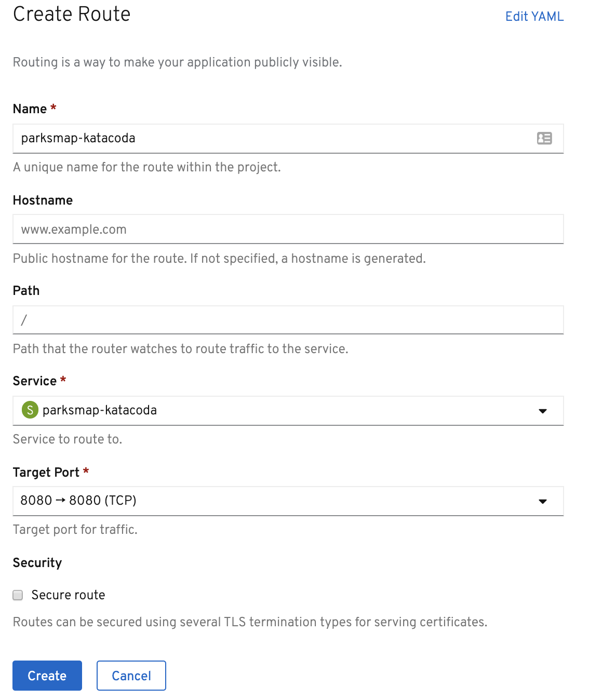

_Services_ provide internal abstraction and load balancing within an OpenShift
environment, but sometimes clients (users, systems, devices, etc.) **outside**
of OpenShift need to access an application. The way that external clients are able
to access applications running in OpenShift is through the OpenShift routing layer.
The data object behind that layer is a _Route_.

The default OpenShift router (HAProxy) uses the HTTP header of the incoming
request to determine where to proxy the connection. You can optionally define
security, such as TLS, for the _Route_. If you want your _Services_, and, by
extension, your _Pods_,  to be accessible to the outside world, you need to
create a _Route_.

## Task: Creating a Route

Fortunately, creating a _Route_ is a pretty straight-forward process.  You just click
the *Create Route* link displayed against the application on the _Overview_ page.

By default, OpenShift is configured to create the _Route_ based on the _Service_ name being exposed and the _Project_ where the application lives, adding a common subdomain configured at the platform level. In our scenario, we have:

**https://[[HOST_SUBDOMAIN]]-8443-[[KATACODA_HOST]].environments.katacoda.com**.

This means that there is no need to change the default settings in the _Route_ creation form.

Once you click _Create_, the _Route_ will be created and displayed in the _Overview_ page.

We can also get the list of all the existing _Routes_ by clicking the _Applications->Routes_ menu:

Currently the list of _Routes_ will only display the one we just created.

In this list, we will be able to see the details associated with the route, such as the hostname, the service, the port the route is exposing, and details on the TLS security for the route, if any.

You can always click on the _Route_ name in this list to modify an existing _Route_.

Now that we know how to create a _Route_, let's verify that the  application is really available at the URL shown in the
web console. Click the link and you will see:

